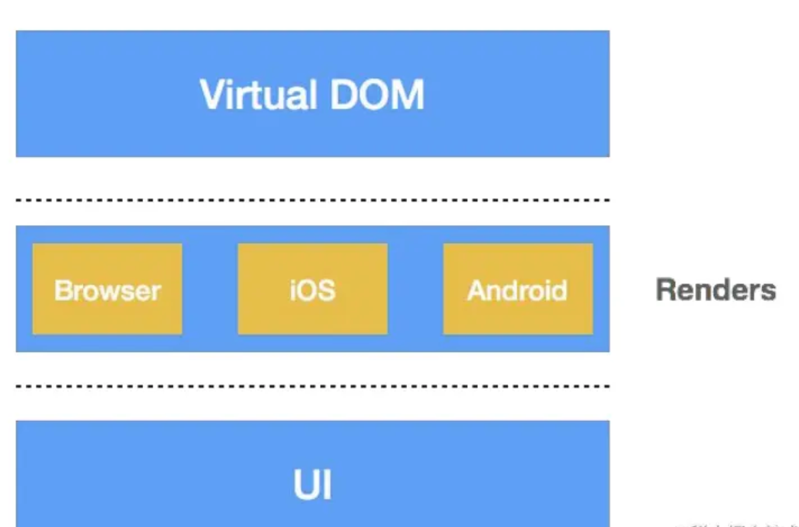
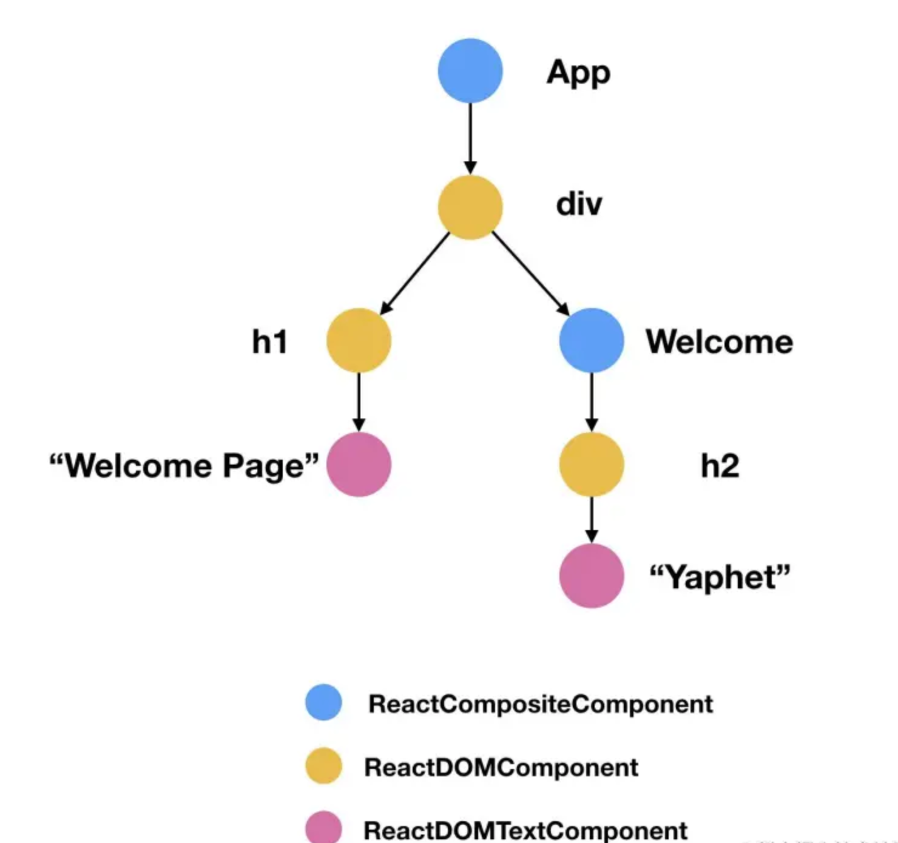

How JavaScript and the Virtual DOM work together with native rendering to enable cross-platform mobile development? 🤔

<!--more-->

# A Quick Look into React Native Principles

## Cross-Platform Technology

**Write once, run everywhere**

- Save manpower, speed up iteration, support rapid business growth
- **Web development** is the most common cross-platform technology

### Advantages

- No release required (you can see the effect immediately after development and going online)
- Save manpower (no need to invest different manpower for multiple platforms)
- Fast iteration (front-end development with HTML and CSS is much faster than native client development)

### Disadvantages

- Experience and performance are worse than native applications
- Difficult to optimize (usually involves modifying the browser kernel, with very limited improvements)

---

## Comparison: Web Development vs Native Development

- **Web**: developed with dynamic languages, generating web views
- **Native**: developed with static languages, generating native views

👉 Can we combine the advantages of Web development and Native development: **use dynamic languages to generate native views?** 🧐

---

## Core Principle

🤩 How to generate native views through JS?

### Virtual DOM

- A JS object describing the user interface
- Platform-independent
- Based on the separation of Virtual DOM and Renderer, React encapsulates platform-specific rendering logic in the Render layer to handle platform-related view rendering.




> Put different base libraries in the Render! We only need to care about how to write the Virtual DOM.

---

## How the Browser Creates Views

### How to Represent a React Element

Two ways to pass React elements into the `ReactDOM.render` method, rendering them into a specified HTML element in the browser:

```javascript
// case 1
class App extends React.Component {}
ReactDOM.render(<App />, document.getElementById("container"));

// case 2
ReactDOM.render(<h1>Hello world</h1>, document.getElementById("container"));
```

In React, an element is represented as an object:

```javascript
var element = {
  // This tag allows us to uniquely identify this as a React Element
  $typeof: REACT_ELEMENT_TYPE,

  // built-in properties that belong on the element
  type: type, // the type of this element
  key: key, // the identifier of this element
  ref: ref, // the reference of this element
  props: props, // element’s properties (children means sub-elements)

  // Record the component responsible for creating this element
  _owner: owner,
};
```

Converted form:

```javascript
// Case 1
<h1><p>Hello world</p></h1>
{
    type: 'h1',
    props:{
        children: {
            type: 'p',
            props: ['Hello world']
        }
    }
}

// Case 2
<App/>
{
    type: App, // Component
}
```

---

### React Element Classification

**Atomic Type** (corresponds to case 1)

- `type` is a string
- Smallest granularity, structurally indivisible
- Rendering: supported by the platform layer
  - In the browser: basic HTML tags
  - In Native: basic UI components

**Composite Type** (corresponds to case 2)

- `type` is a function constructor (Virtual DOM generator), provides custom UI and behavior
- Rendering: create an instance with the constructor, run its render method to get a new element, then render it

---

### Renderer Workflow

For different types, the renderer provides different classes.

- `instantiateComponent`: creates different renderer instances based on the `type`.

  #### Flow

  1. **Virtual DOM Element**
     ↓
  2. **instantiateComponent**
     ↓
  3. **Internal Component Instance**
     ↓
  4. **Generate Real DOM Fragment**
     ↓
  5. **Insert DOM Fragment into DOM Tree**

  ***

  #### Component Types

  ##### In Browser Environment

  - `ReactDOMTextComponent`
  - `ReactDOMComponent`
  - `ReactCompositeComponent`

  ##### In Native Environment

  - `ReactNativeTextComponent`
  - `ReactNativeBaseComponent`
  - `ReactNativeCompositeComponent`

  - For example, if it’s a text element → `ReactDOMTextComponent` in browser environment

---

### Example

Render the following React elements:

```javascript
class App extends React.component {
  render() {
    return (
      <div>
        <h1>Welcome Page</h1>
        <Welcome name="Yaphet" />
      </div>
    );
  }
}

class Welcome extends React.Component {
  render() {
    return <h2>{this.props.name}</h2>;
  }
}

ReactDOM.render(<App />, document.getElementById("container"));
```

---

Process:



- Pass to ReactDOM’s render method
- Instantiate the corresponding renderer (ReactCompositeComponent) → get App node (top)
- App node → based on `type` (constructor) → create instance → run render → get first element inside
- Get `<div>` → create corresponding renderer (ReactDOMComponent) → render into a real DOM node
- Get child elements → instantiate renderers recursively → render DOM nodes
- … and so on down the tree 🌲 …

😍 **Summary**: In the browser, UI is created via **DOM API**.

---

## How Native Creates Views

### JavaScript Engine

- Create JavaScript context:

```
JSContext *context = [[JSContext alloc] init]
```

- Execute code inside the context:

```
[context evaluateScript:@"var triple = function(value) { return value + 3 }"];
```

- Native calls JavaScript:

```
JSValue *tripleFn = context[@"triple"]
```

JS exposes functions/variables globally → Native can access them.
Similarly, for JS to use Native, Native must also expose its functions/variables globally.

---

### React Native JS-Native Communication

In React Native, to avoid polluting the global context with too many modules:

- React Native exposes only **one object**: `_fbBatchedBridge`
- Inside it: method `callFunctionReturnFlushedQueue`
- Native → JS: Native can pass the module name, method name, and parameters to this method → JS executes corresponding module


- JS → Native: also via an intermediate method calling the corresponding module

---

### JS Creates Native UI in React Native

- Call **UI Manager** module’s `createView` method → pass parameters → create client-side view
- **Styles** in React Native are represented by objects, passed as key/value pairs to Native, parsed and rendered by Native

---

😍 **Summary**:

1. JS engine bridges to Native code
2. On Native side, **UI Manager** creates corresponding views
