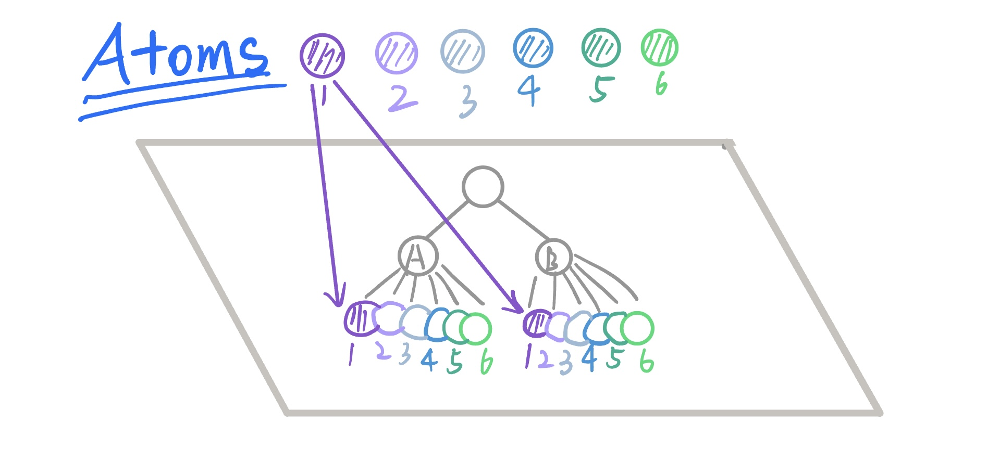
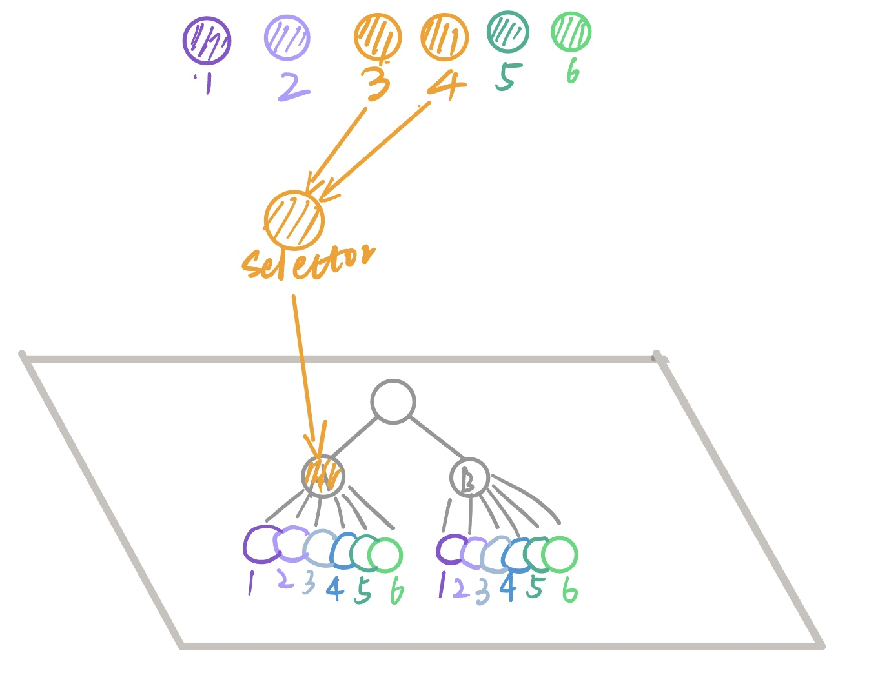

Recoil is a new state management library for React. It lets components share and manage state easily without pulling in heavy tools like Redux.

<!--more-->

## React State Management

State management is a very important issue when building React applications. Currently, commonly used solutions are state management libraries such as Redux or Mobx, but these bring huge overhead.

Compared to introducing external libraries, **using React’s own state management capabilities is certainly a better choice.**

### Some Limitations of Context

The main application scenario of Context is when many **components of different levels** need to access the **same data**.

**Imagine**

If A1B1 depends on Provider1, A2B2 depends on Provider2... (ensuring each group of providers is separate, otherwise one change will cause a full re-render).

* Context can indeed achieve sharing, but the problem is you don’t know exactly how many there are 🥲
* If you want to insert a node, it will change the tree structure, and React will unmount and remount the entire tree (too costly).
* Leaf nodes are coupled with root nodes, making code difficult to split.

## Introduction to Recoil

> 💡 Recoil is a React state management library that provides multiple independent, finer-grained data sources for cross-component state management.

### Atom

Continuing from the above, suppose we flatten this tree onto a table, and then create another tree orthogonal to it floating in the air.

This time, for each item (A1 & B1, A2 & B2 ...), we create a state floating in the air. For example, when state1 updates, A1B1 updates; when state2 updates, A2B2 updates, and so on...




In this way, each item corresponds to its own state, and when this state changes, the corresponding item re-renders.

> 💡 **Two-dimensional transmission => Three-dimensional control**

Each state is a **mutable**, **subscribable** state unit. We give this “state” a name, called “Atoms.”

Now we create a function that takes an id and returns an atom (each item has its own atom).

```JavaScript
id => atom ({
  key: `item${id}`,
  default: {...}
})
```

Each item corresponds to only one atom, so we need to memoize this function. As long as we see a specific id, we use this function.

```JavaScript
export const itemWithId = memorize(id => atom ({
      key: `item${id}`,
      default: {...}
    })
```

In the component, we can use the hooks provided by Recoil to bind this function.

```JavaScript
function Item({id}) {
    const [itemState, setItemState] = useRecoilState(itemWithId(id));
    return ...
}
```

This ensures synchronization between Items, as well as shared state across components.

### Selector (Derived Data)

> Selector is used to compute derived data based on state (avoiding redundant state).

If C1 depends on A1 and B1, then whenever A1 and B1 update, C1 also needs to stay in sync. Too many dependencies may lead to potential errors.

A selector is a pure function: **given the same input, it always produces the same output.**



When the state that a selector depends on changes, this pure function is recalculated, and related components are re-rendered. In fact, subscribing to a selector is equivalent to subscribing to the atoms inside the selector.

* When the selector updates, the selector function is re-executed.
* get (read): When dependent states update, get also updates.
* set (write): Optionally returns a function for writable state (sets state).

> ❗️Only selectors that have both get and set can be readable and writable.

```JavaScript
const fontSizeLabelState = selector({
  key: 'fontSizeLabelState',
  get: ({get}) => {
    const fontSize = get(fontSizeState);
    const unit = 'px';
    return `${fontSize}${unit}`;
  },
  set: ({get, set},newValue) => {
      return set('',newValue)
  },
});
```

**From the component’s perspective**, selector and atom serve the same function — they can both be subscribed to on demand.

### Asynchronous Processing

Selectors support async.

* Just let the get function return a promise.
* Identical inputs will not be queried again; only one query is made for the same input.
* Whenever a dependency changes, the selector is recalculated and a new query is executed. If async dependencies haven’t changed, the async function is not re-executed, and cached values are returned directly. (This is why selectors need to be pure functions.)

```JavaScript
const asyncDataState = selector({
  key: "asyncData",
  get: async ({get}) => {
   // Must be a pure function
   return await getAsyncData();
  }
});

function AsyncComp() {
  const asyncData = useRecoilValue(asyncDataState);
  return <>{asyncData}</>;
}
function Demo() {
  return (
    <React.Suspense fallback={<>loading...</>}>
      <AsyncComp />
    </React.Suspense>
  );
}
```

Recoil supports React.Suspense, and you can use fallback to handle failed requests.

At the same time, Recoil provides **useRecoilValueLoadable, which can be used to get async state.**

```JavaScript
function AsyncComp() {
  const asyncState = useRecoilValueLoadable(asyncDataState);
  if (asyncState.state === "loading") {
    return <>loading...</>;
  }
  if (asyncState.state === "hasError") {
    return <>has error....</>;
  }
  if (asyncState.state === "hasValue") {
    return <>{asyncState.contents}</>;
  }
  return null;
}
```

### Design Philosophy

Split state into individual atoms

\=> derive more states using selectors

\=> React’s component tree subscribes only to the states it needs

> When an atom updates, only the changed atom and its downstream nodes, along with the components subscribed to them, will update.

Using Recoil creates a data flow graph for you, from *atom* (shared state) to *selector* (pure functions), and then flowing into React components.

### Related Hooks

* useRecoilValue(): read operation on Atom/Selector

```JavaScript
const todoList = useSetRecoilValue(todoListState);
```

* useSetRecoilState(): write operation on Atom/Selector (requires selector with write operation)

```JavaScript
const setTodoList = useSetRecoilState(todoListState);
```

* useRecoilState(): read/write operation on Atom/Selector (requires selector with write operation)

```JavaScript
const [todoList, setTodoList] = useSetRecoilState(todoListState);
```
