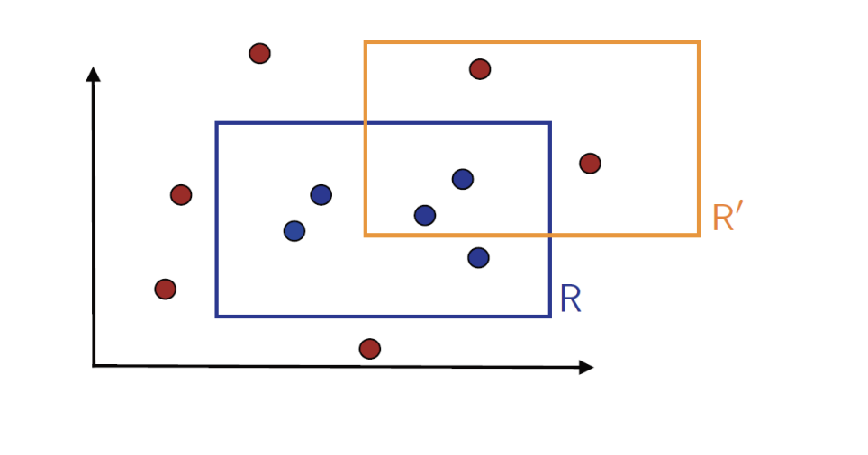
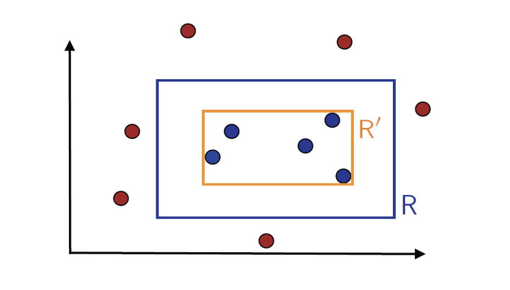
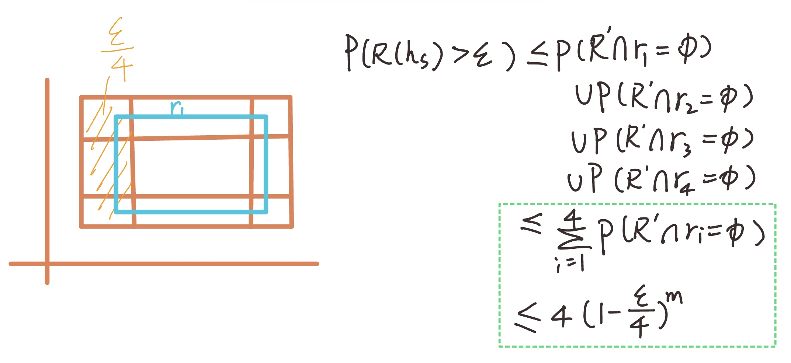
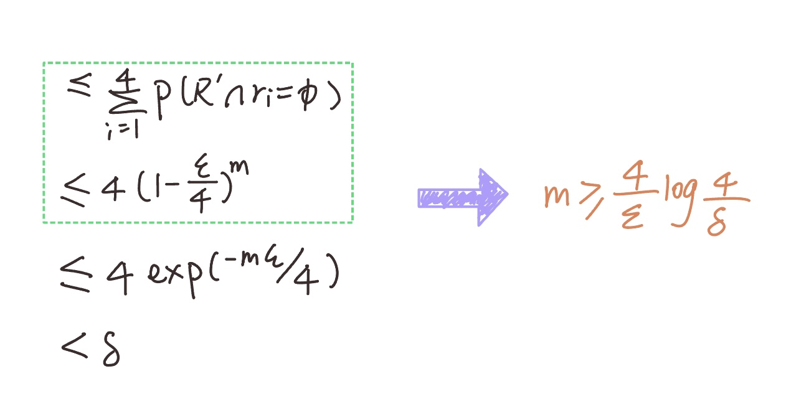

Recoil is a new state management library for React. It lets components share and manage state easily without pulling in heavy tools like Redux.

<!--more-->

# PAC Learning

## 1. Motivation

There is a tradeoff between the `model complexity` and `sample complexity`. （There is a **balance between model capacity and the number of samples** needed for good generalization.

- **Complex models** can fit training data very well but risk **overfitting**, meaning they might not generalize to unseen data.
- **When sample size is small**, we should choose a **simpler hypothesis class** (less expressive model) to avoid overfitting.
- **When we have more data**, we can afford to use a more complex model, as we have enough evidence to learn reliably.

The motivation for PAC learning is to formally characterize **what can be learned** and **how much data is needed** to learn well, while balancing model complexity and avoiding overfitting.

## 2. What is PAC Learning

### 2.1 Definition

PAC stands for `Probably Approximately Correct Learning`. It’s a way to formally answer a simple but fundamental question in machine learning:

> “Given some training data, can I learn a model that is _almost correct_, with _high probability_?”

Here is the official definition:

A concept class $C$ is said to be PAC-learnable if there exists an algorithm $A$ and a polynomial function $poly(·, ·, ·, ·)$ such that for any ϵ > 0 and δ > 0, and for all distributions $D$ on $X$ and for any target concept $c ∈ C$, the following holds for any sample size $m ≥ poly( 1/ϵ , 1/δ , n, size(c))$:

$$
{P}_{S \sim \mathcal{D}^m} \big[ \mathcal{R}(h_S) \leq \epsilon \big] \geq 1 - \delta
$$

### 2.2 Core Idea 🔑

PAC Learning is defined using two key parameters:

- **ε (epsilon)** – the maximum error you’re willing to tolerate.(Test Error)
  We want our learned model’s `test error` to be `≤ ε`.

- **δ (delta)** – the probability of failure you’re willing to accept.（
  We want to **succeed** with probability `≥ 1−δ`

  ​ In the PAC Learning formula, we require:

  $$
  \mathbb{P}[R(h_S) \le \epsilon] \ge 1 - \delta
  $$

  Here, $\delta$ represents the **allowed failure probability**, meaning:

  - With probability $\delta$, the learned model’s error will be **greater** than $\epsilon$ (not good enough).
  - With probability $1-\delta$, the learned model’s error will be **less than or equal** to $\epsilon$ (performs well).

### 2.3 Key Features

- **Distribution-free:** No assumption about the underlying data distribution — it works for _any_ distribution.

- **Sample complexity:** The number of examples needed grows _polynomially_ with 1/ε, 1/δ, so learning is feasible (not exponential).

  For example: if you want to reduce the error to half of its original value, the required number of samples might need to double or grow quadratically — but it will not grow exponentially❕❕❕❕❕❕ 🙅❕❕❕❕❕❕

- **Same distribution:** Training and test examples come from the same distribution, ensuring generalization.

- **Known concept class:** The learner knows the hypothesis space it’s searching over.

### 2.4 Intuition 🧠

- **ε (epsilon)** – The max test error that you can accept for your model
- **δ (delta)** – The model can be called "successful" (only if the test error is smaller than $\epsilon$)

PAC Learning guarantees that :

> If you try **enough times (collect enough examples),** you can find a hypothesis that is both **low error and reliable** (high probability of success).

## 3. Prove: Rectangle Learning

In this section, we can approve whether the problem of Rectangle learning is a `PAC-learnable` problem.

### 3.1 Problem

Learn unknown axis-aligned rectangle R using as small a labeled sample as possible.

### 3.2 PAC-learnable? 🤔

**Simplest Algorithm**: I can choose the `tighest` rectangle R' containing the blue points.

The error $\epsilon$ is the area between two rectangles R and R'

#### Prove:

> 💡 The area between R and R' is error $\epsilon$ ❕❕❕❕❕❕

We can split the rectangle $\epsilon$ as following, and the area of the shadow is $\epsilon / 4$

- **R − R' smaller ⇒ error smaller**
  When the ring-shaped area between \(R\) and \(R'\) becomes smaller, the error also decreases.
- **Left-hand side:**
  $P(R(h_S) > \epsilon)$ is the probability that the error is greater than $\epsilon$.
  This is the same as the probability that the **hypothesis fails**.
  - To ensure success, \(R'\) must lie **completely inside** the border.
- **Right-hand side:**
  The worst case is when the blue rectangle \(R\) and the region \(R − R'\) have **no intersection at all**.

- **r1, r2, r3, r4** are the four borders of the inner rectangle \(R\).

Proof of the Inequality (Green Box):

$(1-\epsilon/4)^m$ represents the probability that **all \(m\) datapoints** fall inside the boundaries $r_1, r_2, r_3, r_4$ (none of them fall into the ring $(R - R')$,
which corresponds to the **worst-case scenario** for the error.

Once the inequality is established, we can conclude:

$$
m \geq \frac{4}{\epsilon} \log \frac{4}{\delta}
$$

To guarantee that the error is at most $\epsilon$ and the success probability is at least $(1 - \delta$
we need at least: $m \geq \frac{4}{\epsilon} \log \frac{4}{\delta}$samples.

This shows that the required number of samples grows linearly with $1/\epsilon$ (accuracy) and logarithmically with $1/\delta$ (confidence).

This means PAC definition holds:

$$
{P}_{S \sim \mathcal{D}^m} \big[ \mathcal{R}(R_S) \leq \epsilon \big] \geq 1 - \delta
$$

Therefore, learning under this setting is **feasible in practice**.

## Generalization Bound

An equivalent way to present sample complexity results is to give a generalization bound: For any δ ∈ (0, 1), the following holds with probability at least 1 − δ:

$$
{R}(h_S) \leq \frac{4}{m} \log \frac{4}{\delta}
$$

- Even infinite hypothesis set is PAC-learnable for this specific example
- It is non-trivial to extend the proof to other concept classes
